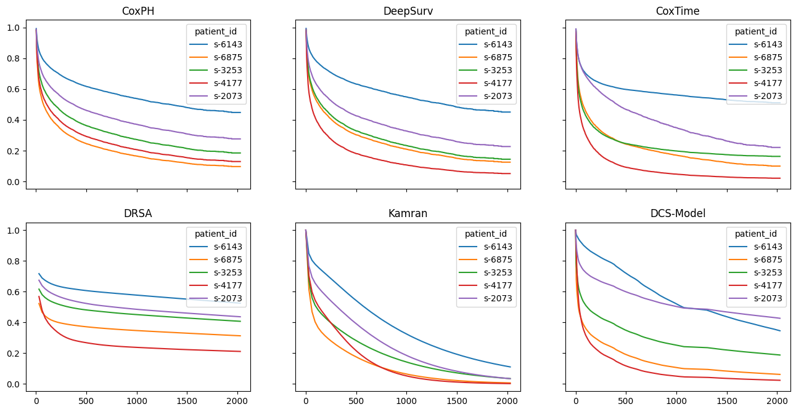

# Discrete Calibrated Survival
This repository provides the code to "Deep Learning-Based Discrete Calibrated Survival
Prediction". A novel deep learning survival analysis approach called DCS.

# Virtual Environment
This repository was developed with `python 3.8.7`. Install the [requirements.txt](requirements.txt)
via `pip install -r 'requirements.txt` to use the package.